# Library Management System - Low-Level Design (LLD)

This repository contains a clean, modular, and thread-safe implementation of a **Library Management System** in Java. The project is designed using key Low-Level Design principles, clean code practices, and object-oriented patterns.

---

## Features

### 1. Book & Inventory Management
* **Catalog Management**: Add, update, and remove unique books in the library catalog.
* **Copy Tracking**: Add and remove specific physical copies (associated with a unique barcode) for any catalog book.
* **Search System**: Search books by title, author, or ISBN.
* **Availability Tracking**: Retrieve lists of available and borrowed book copies.
* **Safe Removal Rules**: Prevent deletion of book metadata if any physical copies are currently checked out.

### 2. Patron Management
* Register new patrons and update their details (name, email).
* Track complete lending history for each patron.

### 3. Lending Process (Checkout & Return)
* Thread-safe book copy checkout and return processing.
* Real-time notification system when a book is checked out or returned.

### 4. Custom Exceptions Hierarchy
Provides meaningful feedback on validation failures instead of silent errors:
* `BookNotFoundException`: Raised when a requested ISBN or barcode copy does not exist.
* `PatronNotFoundException`: Raised when looking up a non-existent patron.
* `BookNotAvailableException`: Raised when checkout is attempted on a non-available copy.
* `BookNotBorrowedException`: Raised when trying to return a copy that isn't checked out by the patron.

---

## Design Patterns Used

1. **Repository Pattern**: decoupled data access logic (`InventoryRepository` and `PatronRepository`) from business rules using in-memory concurrent data structures (`ConcurrentHashMap`).
2. **Observer Pattern**: implemented `Observer` pattern to trigger event notifications (SMS, Email) automatically on book checkout/return. Added safety using `CopyOnWriteArrayList` to handle concurrent additions/removals of listeners.
3. **Encapsulation & Thread Safety**: protected data models (e.g. returning copy lists of borrow histories from `Patron` to prevent illegal modifications) and utilized `synchronized` blocks for transactional state changes.

---

## Class Diagram

The following diagram illustrates the components and relationships between classes:

```mermaid
classDiagram
    class Book {
        -String title
        -String author
        -String isbn
        -int publicationYear
        +getTitle() String
        +getAuthor() String
        +getIsbn() String
        +getPublicationYear() int
    }

    class BookItem {
        -String barcode
        -Book metadata
        -BookStatus status
        +getStatus() BookStatus
        +setStatus(BookStatus status)
        +isAvailable() boolean
        +getBarcode() String
        +getMetadata() Book
    }

    class BookStatus {
        <<enumeration>>
        AVAILABLE
        BORROWED
        RESERVED
    }

    class Patron {
        -String name
        -String email
        -String patronId
        -List~LendingRecord~ borrowHistory
        +getPatronId() String
        +getName() String
        +getEmail() String
        +addLendingRecord(LendingRecord record)
        +getBorrowingHistory() List~LendingRecord~
    }

    class LendingRecord {
        -String recordId
        -String barcode
        -String patronId
        -LocalDateTime checkoutDate
        -LocalDateTime returnDate
        +markReturned()
        +getRecordId() String
        +getBarcode() String
        +getPatronId() String
        +getCheckoutDate() LocalDateTime
        +getReturnDate() LocalDateTime
    }

    class InventoryRepository {
        -Map~String, Book~ booksByIsbn
        -Map~String, BookItem~ itemsByBarcode
        +saveBookMetaData(Book book)
        +findByIsbn(String isbn) Book
        +saveBookItem(BookItem item)
        +findBookByBarCode(String barcode) BookItem
        +removeItemByBarcode(String barcode)
        +getAllItems() List~BookItem~
        +removeBookMetaData(String isbn)
        +getAllBooks() List~Book~
    }

    class PatronRepository {
        -Map~String, Patron~ patronsById
        +save(Patron patron)
        +findById(String patronId) Patron
    }

    class LibraryService {
        -InventoryRepository inventoryRepo
        -PatronRepository patronRepo
        -List~Observer~ observers
        +addBookCopy(String barcode, String isbn, String title, String author, int publicationYear)
        +removeCopy(String barcode)
        +updateBookMetadata(String isbn, String updatedTitle, String updatedAuthor, int updatedYear)
        +addBook(String isbn, String title, String author, int publicationYear)
        +removeBook(String isbn)
        +searchBooks(String query) List~Book~
        +searchBookItems(String query) List~BookItem~
        +getAvailableItems() List~BookItem~
        +getBorrowedItems() List~BookItem~
        +checkoutBookItem(String barcode, String patronId)
        +returnBookItem(String barcode, String patronId)
        +registerPatron(String patronId, String name, String email)
        +updatePatronDetails(String patronId, String name, String email)
        +getPatronBorrowingHistory(String patronId) List~LendingRecord~
        +registerObserver(Observer observer)
        +removeObserver(Observer observer)
    }

    class Observer {
        <<interface>>
        +onBookCheckedOut(BookItem item, Patron patron)
        +onBookReturned(BookItem item, Patron patron)
    }

    class EmailNotificationService {
        +onBookCheckedOut(BookItem item, Patron patron)
        +onBookReturned(BookItem item, Patron patron)
    }

    class SmsObserverService {
        +onBookCheckedOut(BookItem item, Patron patron)
        +onBookReturned(BookItem item, Patron patron)
    }

    class LibraryException {
        +LibraryException(String message)
    }

    BookItem --> Book : references
    BookItem --> BookStatus : has
    Patron --> LendingRecord : has list of
    LibraryService --> InventoryRepository : uses
    LibraryService --> PatronRepository : uses
    LibraryService --> Observer : notifies list of
    EmailNotificationService ..|> Observer : implements
    SmsObserverService ..|> Observer : implements
    BookNotFoundException --|> LibraryException : extends
    PatronNotFoundException --|> LibraryException : extends
    BookNotAvailableException --|> LibraryException : extends
    BookNotBorrowedException --|> LibraryException : extends
```



---

## How to Compile & Run

### Prerequisites
* Java Development Kit (JDK 11 or higher)

### Steps

1. **Clone the repository** (Ensure it is public when pushed to GitHub):
   ```bash
   git clone <your-repository-url>
   cd Library-Management-System-LLD
   ```

2. **Compile the source files**:
   ```bash
   javac -d out -sourcepath src src/com/airtribe/librarymanagement/corefunctionality/Main.java
   ```

3. **Run the demonstration**:
   ```bash
   java -cp out com.airtribe.librarymanagement.corefunctionality.Main
   ```
